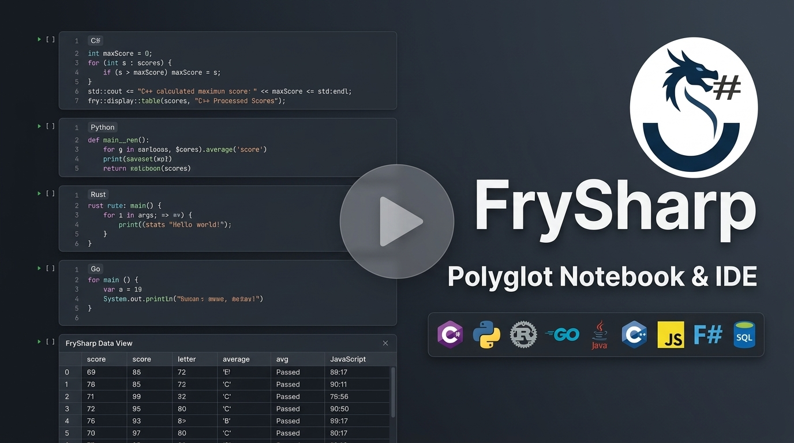
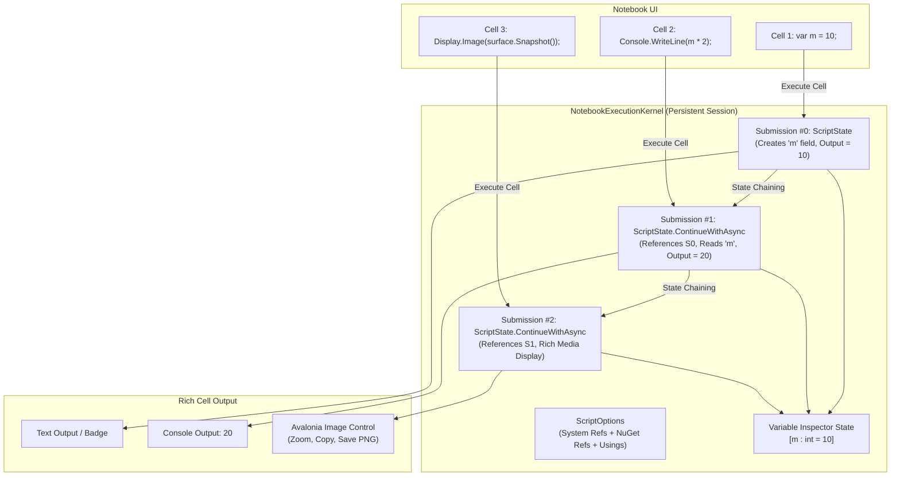

# CSharpPlayground (FrySharp)

[](https://github.com/PrashantUnity/CSharpPlayground/actions/workflows/ci.yml)
[](LICENSE)
[](https://dotnet.microsoft.com/)
[](https://avaloniaui.net/)

**CSharpPlayground** (standalone executable: **FrySharp**) is an interactive multi-language code studio, polyglot Jupyter-style notebook environment for .NET 10, Python, Rust, and extensible language toolchains built with Avalonia UI.

It operates both as:
1. **A Standalone Desktop Application (`FrySharp`)**: Native desktop app for macOS (`.dmg`) and Windows (`.msix` / `.exe` installer) with VS Code-inspired layout.
2. **A FryPDF Ecosystem Plugin (`com.frypdf.plugin.csharpeditor`)**: Edge-to-edge full-viewport workspace and code automation plugin for FryPDF.

---

## 🎬 Product Demo

[](https://www.youtube.com/watch?v=g1Y4RSxxqIc)

**[Click here to watch the FrySharp Demo on YouTube](https://www.youtube.com/watch?v=g1Y4RSxxqIc)** — *Supports C#, Python, Rust, Go, Java, C++, JavaScript, F# & SQL*

---

## 🚀 Quick Start

### Prerequisites
- [.NET 10 SDK](https://dotnet.microsoft.com/download)
- Optional: [Python 3.9+](https://www.python.org/downloads/) for `.py` files and Python notebook cells

### Run Standalone Desktop App (FrySharp)
```bash
# Clone the repository
git clone https://github.com/PrashantUnity/CSharpPlayground.git
cd CSharpPlayground

# Run standalone desktop app
dotnet run --project Runner/CSharpEditorPlugin.Runner.csproj
```

### Run Automated Unit Tests
```bash
# Run the unit tests (the real-Python ones run when Python 3.9+ is installed)
dotnet test CSharpEditorPlugin.slnx
```

---

## 📦 Solution Structure

```
CSharpPlayground/
├── CSharpEditorPlugin.slnx         # Modern XML solution (Engine + Runner + Tests)
├── CSharpEditorPlugin.csproj       # Core Studio & Plugin library (.NET 10)
├── CSharpEditorPlugin.cs           # IFryPlugin entrypoint
├── plugin.json                     # FryPDF marketplace manifest
├── Controls/                       # VS Code activity bar, status bar, tabs, editor
├── Models/                         # POCO models for scripts, cells, diagnostics
├── Services/                       # Roslyn compiler, kernel, completion, debugger
│   ├── Languages/                  # Language registry and one module per language (Python/Kernel: the kernel program; Rust: Cargo, fry, lldb-dap)
│   ├── Toolchains/ Processes/      # Finding installed toolchains; running programs (stdin, Stop, cleanup)
│   └── Kernels/ Packages/          # Notebook kernels per language, #!share, the kernel protocol; pip
├── ViewModels/                     # Reactive MVVM view models
├── Views/                          # Avalonia XAML views (Studio, Notebook, Manager)
├── Runner/                         # Standalone desktop executable (FrySharp)
│   ├── CSharpEditorPlugin.Runner.csproj
│   ├── Program.cs / App.axaml
│   └── MainWindow.axaml
├── Tests/                          # Comprehensive xUnit test suite (2,100+ tests; Real*/ folders need each real toolchain: Python, Rust, Go, Delve, netcoredbg…)
│   └── CSharpEditorPlugin.Tests.csproj
├── tools/UiSnapshots/              # Headless renderer: real views to PNG, for checking UI changes
├── docs/                           # Developer guides: headless UI snapshots, adding a language, the kernel protocol
└── packaging/                      # macOS DMG & Windows MSIX/Inno packaging assets
```

---

## 🏗 Architecture: Stateful Notebook Execution


```mermaid
flowchart TD
    subgraph Notebook UI
        C1["Cell 1: var m = 10;"]
        C2["Cell 2: Console.WriteLine(m * 2);"]
        C3["Cell 3: Display.Image(surface.Snapshot());"]
    end

    subgraph "NotebookExecutionKernel (Persistent Session)"
        Init["ScriptOptions\n(System Refs + NuGet Refs + Usings)"]
        S0["Submission #0: ScriptState\n(Creates 'm' field, Output = 10)"]
        S1["Submission #1: ScriptState.ContinueWithAsync\n(References S0, Reads 'm', Output = 20)"]
        S2["Submission #2: ScriptState.ContinueWithAsync\n(References S1, Rich Media Display)"]
        VarExp["Variable Inspector State\n[m : int = 10]"]
    end

    subgraph Rich Cell Output
        Out1["Text Output / Badge"]
        Out2["Console Output: 20"]
        Out3["Avalonia Image Control\n(Zoom, Copy, Save PNG)"]
    end

    C1 -->|"Execute Cell"| S0
    S0 -->|"State Chaining"| S1
    C2 -->|"Execute Cell"| S1
    S1 -->|"State Chaining"| S2
    C3 -->|"Execute Cell"| S2
    
    S0 --> VarExp
    S1 --> VarExp
    S2 --> VarExp

    S0 --> Out1
    S1 --> Out2
    S2 --> Out3
```

---

## 📜 License
MIT License. See [LICENSE](LICENSE) for details.